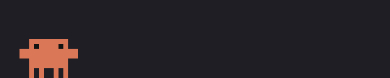
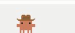
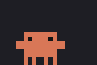
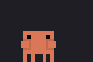
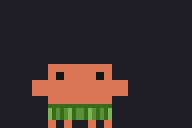
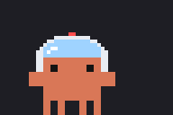

# Claude Pet — Clawd lives in your Claude Code

**English** · [简体中文](README.zh-CN.md)

<p align="center"></p>

**Clawd** is a pixel pet that strolls along the band above your Claude Code prompt and reacts to what Claude is doing: chin in hand while thinking, looking around while searching, typing on a laptop while running commands, waving when it's waiting for you, and dozing off late at night.

## In action

**Terminal (Ghostty)**


**Desktop app (Code tab)**



## Moves

| | | | |
|:-:|:-:|:-:|:-:|
|  |  |  |  |
| thinking | running a command | waiting for you | /pet idea |
|  |  |  |  |
| /pet dance | /pet breakdance | /pet hula | /pet jump |
|  |  |  |  |
| /pet party | /pet meditate | /pet spin · clicked too much | /pet hat … |


## Features

- **Follows Claude's state**: thinking, searching, editing, running commands, calling subagents, waiting for your answer, or running low on context — each has its own animation and caption.
- **Grows with you**: feed it and pat it. Its level tracks your lifetime Claude Code token usage (one level per 100M tokens) and unlocks new moves and titles (Hatchling → Explorer → Dancer → … → Infinite).
- **Hats**: wizard hat, ninja headband, top hat, cowboy hat, astronaut helmet, crown.
- **Click to interact**: click Clawd to pat it; click too much and it gets dizzy.
- **Pixel-perfect where possible**: drawn as a real image in Ghostty, kitty and iTerm2; block characters elsewhere. Works in the desktop app's Code tab too.
- **Optional sounds**: tiny chiptune reactions, off by default.

## Requirements

- A Claude Code build that supports **mods** (plugins whose `hooks/hooks.json` loads `modules`), in the terminal CLI or the desktop app's Code tab.
- For the pixel image, use Ghostty, kitty or iTerm2.

## Install

Run these in Claude Code:

```
/plugin marketplace add yuyongyan29-dev/claude-pet
/plugin install clawd-pet@claude-pet-market
```

Start a new session and Clawd appears above the prompt.

**Update**

```
/plugin marketplace update claude-pet-market
```

**Uninstall**

```
/plugin uninstall clawd-pet@claude-pet-market
```

## Commands

Everything is a `/pet` subcommand; `/pet help` lists them anytime.

| Command | What it does |
| --- | --- |
| `/pet` | Show / hide (hiding lasts until the session ends) |
| `/pet feed` · `/pet pat` | Feed · pat |
| `/pet size 6` | Size 4–40 (body width in columns); also `/pet bigger` · `/pet smaller` |
| `/pet come` · `run` · `stay` · `roam` | Come here · run a lap · stay put · wander again |
| `/pet dance` · `breakdance` · `hula` · `jump` · `hop` · `wave` · `party` · `spark` · `idea` · `think` · `meditate` · `spin` … | Tricks (some unlock at higher levels) |
| `/pet hat wizard` · `ninja` · `tophat` · `cowboy` · `astronaut` · `crown` · `off` | Put on / take off a hat |
| `/pet name Crabby` | Rename |
| `/pet sound on` · `off` | Sounds on / off |
| `/pet hd` · `/pet pixel` | Switch between image and block rendering |
| `/pet stats` | Level, title, hunger, mood, moves learned |

## Data

Pet state (name, level, hunger, hat, size…) is saved in `clawd-pet.json` in your Claude config directory (usually `~/.claude/clawd-pet.json`). Delete it to start over. The plugin makes no network requests and uploads nothing.

## FAQ

- **Installed but no Clawd?** Run `/pet` in case it's hidden, check that your Claude Code supports mods, then start a new session.
- **Blocks instead of a pixel image?** Your terminal doesn't support an image protocol. Use Ghostty / kitty / iTerm2, or try `/pet hd`.
- **Too big or too small?** Anything from `/pet size 4` to `/pet size 40`.

## Repository layout

```
.claude-plugin/marketplace.json   marketplace manifest (claude-pet-market)
clawd-pet/
  .claude-plugin/plugin.json      plugin manifest
  hooks/                          the mod: register.tsx, sprites, hats, click handling
  frames/ frames-hat/             pre-rendered pixel frames (plain and with hats)
  sounds/                         chiptune reaction sounds
  tests/                          mod tests (claude-code/testing)
  tools/gen_hats.py               regenerates hats.ts and frames-hat/
```

## Credits

Clawd and its animations come from Anthropic's clawd-quest sprites in the Claude desktop app. This is an unofficial fan project, not affiliated with or endorsed by Anthropic.
